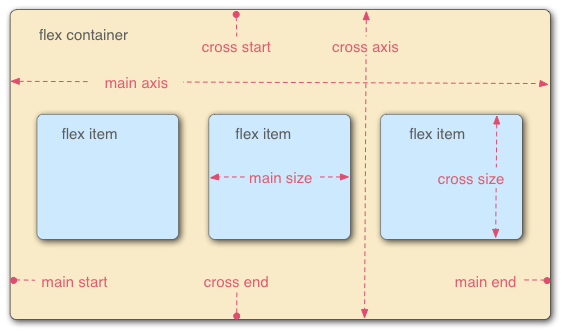

# Flex 布局

Flex 是2009年提出的新的布局方案，用来代替原来的盒状模型。

- [容器属性](#容器属性)
  - [flex-direction: 主轴方向](#flex-direction-主轴方向)
  - [flex-wrap: 是否换行](#flex-wrap-是否换行)
  - [flex-flow: direction+wrap](#flex-flow-directionwrap)
  - [justify-content: 主轴上的对齐方式](#justify-content-主轴上的对齐方式)
  - [align-items: 交叉轴上的对齐方式](#align-items-交叉轴上的对齐方式)
  - [align-content: 多根轴线的对齐方式](#align-content-多根轴线的对齐方式)
- [项目的属性](#项目的属性)
  - [order: \<integer>: 项目的排列顺序](#order-integer-项目的排列顺序)
  - [flex-grow: \<number>: 定义项目的放大比例](#flex-grow-number-定义项目的放大比例)
  - [flex-shrink: \<number>: 定义了项目的缩小比例](#flex-shrink-number-定义了项目的缩小比例)
  - [flex-basis: \<length> or auto 在分配多余空间之前，项目占据的主轴空间](#flex-basis-length-or-auto-在分配多余空间之前项目占据的主轴空间)
  - [flex: flex-grow + flex-shrink + flex-basis](#flex-flex-grow--flex-shrink--flex-basis)
  - [align-self: item 的对齐方式](#align-self-item-的对齐方式)

## 容器属性

### flex-direction: 主轴方向

决定主轴的方向（即项目的排列方向）

1. `flex-direction: row` （默认值）：主轴为水平方向，起点在左端。
    

Show

    

        
1

        
2

        
3

    

    

2. `flex-direction: row-reverse` 主轴为水平方向，起点在右端。
    

Show

    

        
1

        
2

        
3

    

    

3. `flex-direction: column` 主轴为垂直方向，起点在上沿。
    

Show

    

        
1

        
2

        
3

        
4

    

    

4. `flex-direction: column-reverse` 主轴为垂直方向，起点在下沿。
    

Show

    

        
1

        
2

        
3

        
4

    

    

### flex-wrap: 是否换行

默认情况下，项目都排在一条线，flex-wrap 可以设置拍不下之后换行

1. `flex-wrap: nowrap` （默认）：不换行
    

Show

    

        
1

        
2

        
3

        
4

        
5

        
6

    

    

1. `flex-wrap: wrap` 换行，第一行在上方。
    

Show

    

        
1

        
2

        
3

        
4

        
5

        
6

    

    

3. `flex-wrap: wrap-reverse`  换行，第一行在下方。
    

Show

    

        
1

        
2

        
3

        
4

        
5

    

    

### flex-flow: direction+wrap

flex-flow 属性是 flex-direction 属性和 flex-wrap 属性的简写形式，默认值为 row nowrap。

1. `flex-flow: row wrap` 水平，换行
    

Show

    

        
1

        
2

        
3

        
4

        
5

    

    

2. `flex-flow: row nowrap` 水平，不换行
    

Show

    

        
1

        
2

        
3

        
4

        
5

    

    

### justify-content: 主轴上的对齐方式

justify-content 属性定义了项目在主轴上的对齐方式。

1. `justify-content: flex-start` 左对齐
    

Show

    

        
1

        
2

        
3

        
4

        
5

    

    

2. `justify-content: flex-end` 右对齐
    

Show

    

        
1

        
2

        
3

        
4

        
5

    

    

3. `justify-content: center` 居中
    

Show

    

        
1

        
2

        
3

        
4

        
5

    

    

4. `justify-content: space-between` 两端对齐
    

Show

    

        
1

        
2

        
3

        
4

        
5

    

    

5. `justify-content: space-around` 左对齐
    

Show

    

        
1

        
2

        
3

        
4

        
5

    

    

### align-items: 交叉轴上的对齐方式

align-items 属性定义项目在交叉轴上如何对齐。

1. `align-items: flex-start` 交叉轴的起点对齐
    

Show

    

        
1

        
2

        
3

        
4

        
5

    

    

2. `align-items: flex-end` 交叉轴的终点对齐
    

Show

    

        
1

        
2

        
3

        
4

        
5

    

    

3. `align-items: center` 交叉轴的中点对齐
    

Show

    

        
1

        
2

        
3

        
4

        
5

    

    

4. `align-items: baseline` 项目的第一行文字的基线对齐
    

Show

    

        
1

        
2

        
3

        
4

        
5

    

    

5. `align-items: stretch` 如果项目未设置高度或设为auto，将占满整个容器的高度
    

Show

    

        
1

        
2

        
3

        
4

        
5

    

    

    
### align-content: 多根轴线的对齐方式

align-content属性定义了多根轴线的对齐方式。如果项目只有一根轴线，该属性不起作用。

1. `align-content: flex-start` 与交叉轴的起点对齐
    

Show

    

        
1

        
2

        
3

        
4

        
5

        
6

        
7

        
8

        
auto

    

    

2. `align-content: flex-end` 与交叉轴的终点对齐
    

Show

    

        
1

        
2

        
3

        
4

        
5

        
6

        
7

        
8

        
auto

    

    

3. `align-content: center` 与交叉轴的中点对齐
    

Show

    

        
1

        
2

        
3

        
4

        
5

        
6

        
7

        
8

        
auto

    

    

4. `align-content: space-between` 与交叉轴两端对齐，轴线之间的间隔平均分布
    

Show

    

        
1

        
2

        
3

        
4

        
5

        
6

        
7

        
8

        
auto

    

    

5. `align-content: space-around` 每根轴线两侧的间隔都相等。所以，轴线之间的间隔比轴线与边框的间隔大一倍。
    

Show

    

        
1

        
2

        
3

        
4

        
5

        
6

        
7

        
8

        
auto

    

    

6. `align-content: stretch` 轴线占满整个交叉轴。
    

Show

    

        
1

        
2

        
3

        
4

        
5

        
6

        
7

        
8

        
auto

    

    

## 项目的属性

### order: \<integer>: 项目的排列顺序

Show

    

        
100

        
-1

        
9

        
0

        
1

    

### flex-grow: \<number>: 定义项目的放大比例

默认为 0，即如果存在剩余空间，也不放大。

Show

    

        
0

        
0

        
0

    

        

        
1

        
1

        
1

    

        

        
0

        
1

        
2

    

### flex-shrink: \<number>: 定义了项目的缩小比例

默认为1，即如果空间不足，该项目将缩小。

Show

    

        
0

        
0

        
0

    

    

        
1

        
1

        
1

    

    

        
0

        
1

        
1

    

### flex-basis: \<length> or auto 在分配多余空间之前，项目占据的主轴空间

浏览器根据这个属性，计算主轴是否有多余空间。它的默认值为auto，即项目的本来大小。它可以设为跟width或height属性一样的值（比如350px），则项目将占据固定空间。

Show

    

        
auto

        
100

    

    

        
100

        
auto

    

### flex: flex-grow + flex-shrink + flex-basis

默认值为 0 1 auto。后两个属性可选。
两个快捷值：auto (1 1 auto) 和 none (0 0 auto)。

1. flex: auto
    

Show

    

        
auto

        
auto

    

    

        
auto

        
auto

    

    

2. flex: none
    

Show

    

        
non

        
non

    

    

        
non

        
non

    

    

### align-self: item 的对齐方式

允许单个项目有与其他项目不一样的对齐方式，可覆盖align-items属性。

Show

    

        
1

        
2

        
3

        
4

        
5

    

